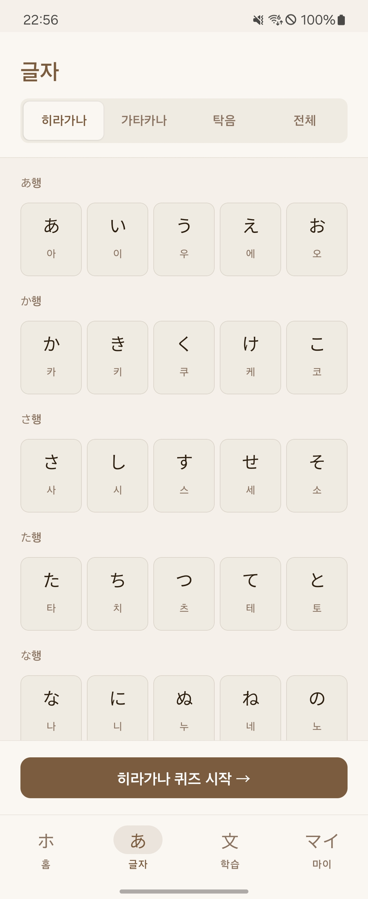
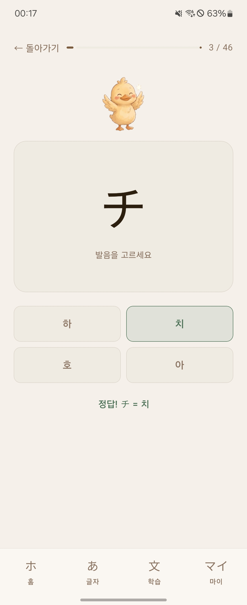
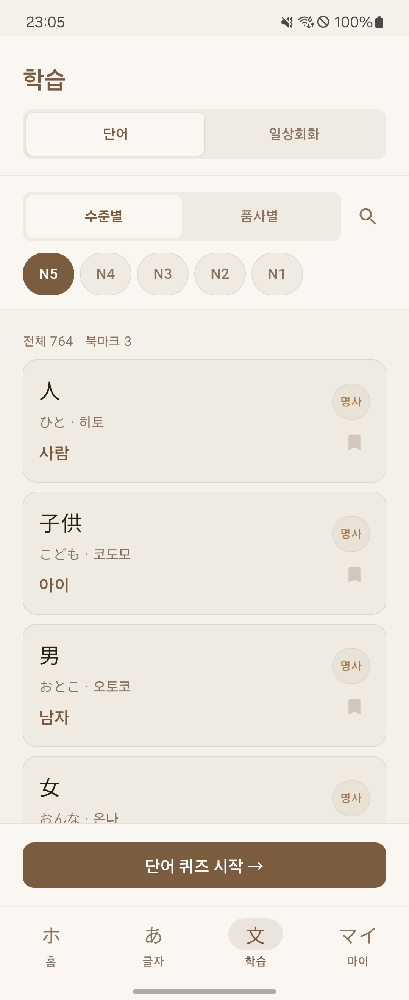
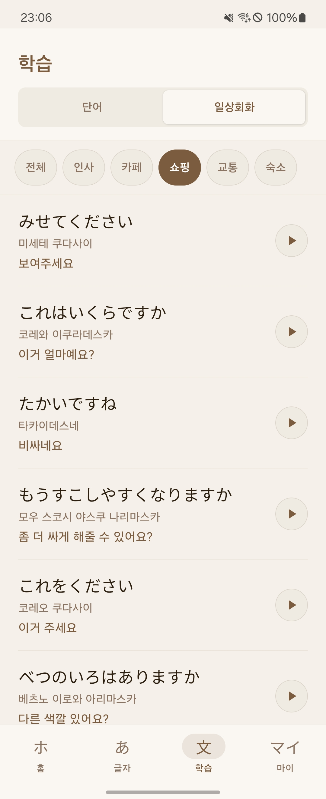
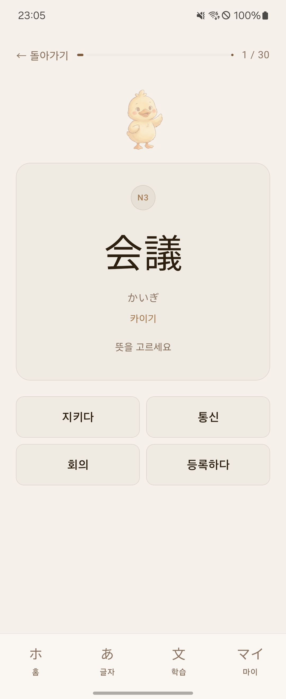

## 📑 프로젝트 요약

**시오리(Shiori)** 는 일본어를 처음 배우는 학습자를 위한 Android 학습 앱입니다.

히라가나·가타카나부터 N5 수준 단어, 일상회화 문장까지 — 체계적인 커리큘럼과 퀴즈, 북마크 단어장을 통해 꾸준한 일본어 학습을 돕습니다.

1.  **글자 학습**: 히라가나·가타카나·탁음 46자를 행별 그리드로 보기 쉽게 표시

2. **글자 퀴즈**: 학습한 글자를 4지선다 퀴즈로 복습

3. **단어 학습**: JLPT 출제 단어를 수준별, 품사별로 탐색하고 북마크로 저장

4. **일상회화**: 자주 쓰이는 회화 문장 110개를 카테고리별로 학습하고 원어민 음성듣기 가능

5. **단어 퀴즈**: 북마크한 단어나 지정한 범위에서 뜻 맞추기 또는 일본어 맞추기 퀴즈 진행 가능

## 📱 스크린샷

|                 1                  |                 2                  |                 3                  |                 4                  |                 5                  |
|:----------------------------------:|:----------------------------------:|:----------------------------------:|:----------------------------------:|:----------------------------------:|
|  |  |  |  |  |

---

## 🏗️ 아키텍쳐

**Clean Architecture** + **MVI (Model-View-Intent)** 패턴
```
app/src/main/java/com/us9988/mvi/
├── data/
│   ├── local/              # Room DB, DAO, Entity
│   │   ├── entity/
│   │   ├── dao/
│   │   └── datasource/     # 로컬 데이터 (단어, 회화)
│   ├── repository/         # Repository 구현체
│   └── model/              # 데이터 모델
├── domain/
│   ├── model/              # 도메인 모델
│   ├── repository/         # Repository 인터페이스
│   └── usecase/            # 비즈니스 로직
└── presentation/
├── base/               # MviViewModel, MviEvent, MviState, MviEffect
├── analytics/          # Firebase Analytics, Crashlytics
├── ad/                 # AdMob 관리
├── billing/            # 인앱 결제 (프리미엄)
└── feature/
├── home/           # 홈 화면
├── kana/           # 글자 학습 · 퀴즈
├── word/           # JLPT 단어
├── conversation/   # 일상회화
├── wordquiz/       # 단어 퀴즈
└── my/             # 내 단어장 · 설정
```

### 데이터 흐름

```
WordLocalDataSource  ──→  WordDao  ──→  WordRepository
                                              ↓
                                        GetWordsUseCase
                                              ↓
                                        WordViewModel
                                              ↓
                                         WordScreen
```
 
---

## 🛠️ 기술 스택

### Android
| 분류 | 기술 |
|------|------|
| **UI** | Jetpack Compose, Material 3 |
| **아키텍처** | Clean Architecture, MVI |
| **DI** | Hilt |
| **DB** | Room |
| **환경설정** | DataStore |
| **네비게이션** | Navigation Compose |
| **비동기** | Coroutines, Flow |
| **오디오** | ExoPlayer (Media3) |
| **이미지** | Coil |

### 기타
| 분류 | 기술 |
|------|------|
| **분석** | Firebase Analytics |
| **오류 추적** | Firebase Crashlytics |
| **광고** | Google AdMob |
| **인앱 결제** | Google Play Billing |
 
---